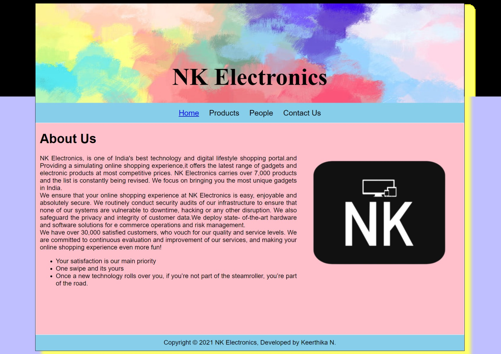
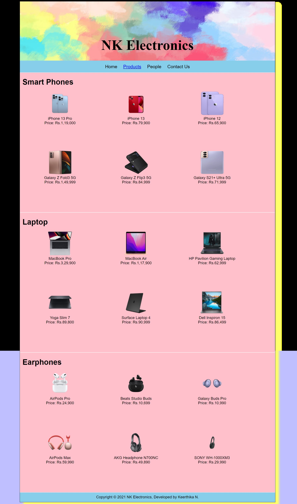
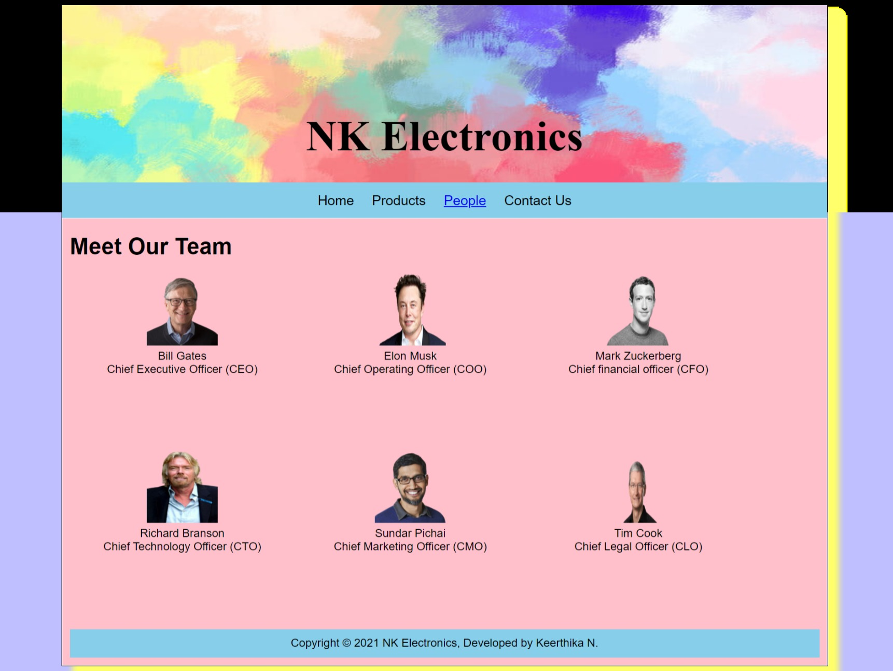
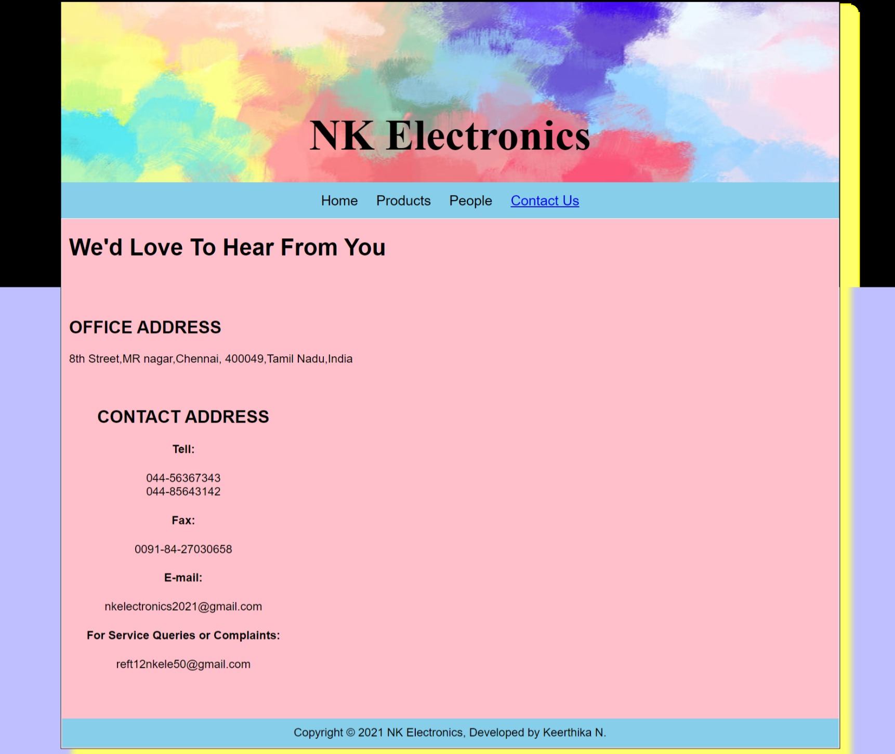

# Web Design for a Software Product Company

## AIM:

To design a static website for a software product company company.

## DESIGN STEPS:

### Step 1:

Requirement collection.

### Step 2:

Creating the layout using HTML and CSS.

### Step 3:

Updating the sample content.

### Step 4:

Choose the appropriate style and color scheme.

### Step 5:

Validate the layout in various browsers.

### Step 6:

Validate the HTML code.

### Step 6:

Publish the website in the given URL.

## PROGRAM :

### Home Page HTML Coding:

```
<!DOCTYPE html>
<html lang="en">
  <head>
    <title> NK Electronics </title>
    <link rel="stylesheet" href="./css/layout.css" />
    <link rel="icon" href="./img/icon.png" type="image/x-icon" />
  </head>

  <body>   
    <div class="container">
      <div class="banner">NK Electronics</div>
      <div class="menu">
        <div class="menuitemselected"><a href="/static/home.html">Home</a></div>
        <div class="menuitem"><a href="/static/products.html">Products</a></div>
        <div class="menuitem"><a href="/static/people.html">People</a></div>
        <div class="menuitem"><a href="/static/contact us.html">Contact Us</a></div>
      </div>
      <div class="content">
        <div class="homecontent">
          <h1>About Us</h1>
          
          <div class="contenttext">
            NK Electronics, is one of India's best technology and digital 
            lifestyle shopping portal.and Providing a simulating online 
            shopping experience,it offers the latest range of gadgets and 
            electronic products at most competitive prices. NK Electronics
            carries over 7,000 products and the list is constantly being revised.
            We focus on bringing you the most unique gadgets in India. 
            <br />
            We ensure that your online shopping experience at NK Electronics is easy,
            enjoyable and absolutely secure. We routinely conduct security audits of 
            our infrastructure to ensure that none of our systems are vulnerable to 
            downtime, hacking or any other disruption. We also safeguard the privacy 
            and integrity of customer data.We deploy state- of-the-art hardware and 
            software solutions for e commerce operations and risk management.
           <br />
           We have over 30,000 satisfied customers, who vouch for our quality and service
           levels. We are committed to continuous evaluation and improvement of our 
           services, and making your online shopping experience even more fun!
           <ul>
              <li>Your satisfaction is our main priority</li>
              <li>One swipe and its yours</li>
              <li>Once a new technology rolls over you, if you’re not part of the steamroller, 
              you’re part of the road.</li>
            </ul>
          </div>
        </div>
      </div>
      <div class="footer">
        Copyright &#169; 2021 NK Electronics, Developed by Keerthika N.
      </div>
    </div>
  </body>
</html>
```

### Product Page HTML Coding:
```
<!DOCTYPE html>
<html lang="en">
  <head>
    <title>NK Electronics</title>
    <link rel="stylesheet" href="./css/layout.css" />
    <link rel="icon" href="./img/icon.png" type="image/x-icon" />
  </head>

  <body>
    <div class="container">
      <div class="banner">NK Electronics</div>
      <div class="menu">
        <div class="menuitem"><a href="/static/home.html">Home</a></div>
        <div class="menuitemselected"><a href="/static/products.html">Products</a></div>
        <div class="menuitem"><a href="/static/people.html">People</a></div>
        <div class="menuitem"><a href="/static/contact us.html">Contact Us</a></div>
      </div>
      <div class="content">
        <div class="productcontent">    
          <h1>Smart Phones</h1>
          <div class="productitems">
              <div class="productitem"> 
                  <div class="itemimage">
                  
                  </div>
                  <div class="itemname">iPhone 13 Pro</div>
                  <div class="itemprice">Price: Rs.1,19,000</div>
              </div>
              <div class="productitem"> 
                  <div class="itemimage">
                  
                  </div>
                  <div class="itemname">iPhone 13</div>
                  <div class="itemprice">Price: Rs.79,900</div>
              </div>
              <div class="productitem"> 
                <div class="itemimage">
                
                </div>
                <div class="itemname">iPhone 12</div>
                <div class="itemprice">Price: Rs.65,900</div>
            </div>
            <div class="productitem"> 
              <div class="itemimage">
              
              </div>
              <div class="itemname">Galaxy Z Fold3 5G</div>
              <div class="itemprice">Price: Rs.1,49,999</div>
          </div>
          <div class="productitem"> 
            <div class="itemimage">
            
            </div>
            <div class="itemname">Galaxy Z Flip3 5G</div>
            <div class="itemprice">Price: Rs.84,999</div>
        </div>
        <div class="productitem"> 
          <div class="itemimage">
          
          </div>
          <div class="itemname">Galaxy S21+ Ultra 5G</div>
          <div class="itemprice">Price: Rs.71,999</div>
      </div>
          </div>
          </div>        
      </div>
      <div class="content">
        <div class="productcontent">    
          <h1>Laptop</h1>
          <div class="productitems">
            <div class="productitem"> 
              <div class="itemimage">
              
              </div>
              <div class="itemname">MacBook Pro</div>
              <div class="itemprice">Price: Rs.3,29,900</div>
          </div>
          <div class="productitem"> 
            <div class="itemimage">
            
            </div>
            <div class="itemname">MacBook Air</div>
            <div class="itemprice">Price: Rs.1,17,900</div>
        </div>
        <div class="productitem"> 
          <div class="itemimage">
          
          </div>
          <div class="itemname">HP Pavilion Gaming Laptop</div>
          <div class="itemprice">Price: Rs.62,999</div>
      </div>
      <div class="productitem"> 
        <div class="itemimage">
        
        </div>
        <div class="itemname">Yoga Slim 7</div>
        <div class="itemprice">Price: Rs.89,800</div>
    </div>
    <div class="productitem"> 
      <div class="itemimage">
      
      </div>
      <div class="itemname">Surface Laptop 4</div>
      <div class="itemprice">Price: Rs.90,999</div>
  </div>
  <div class="productitem"> 
    <div class="itemimage">
    
    </div>
    <div class="itemname">Dell Inspiron 15 </div>
    <div class="itemprice">Price: Rs.86,499</div>
</div>
</div>
</div>
</div>
<div class="content">
  <div class="productcontent">    
    <h1>Earphones</h1>
    <div class="productitems">
      <div class="productitem"> 
        <div class="itemimage">
        
        </div>
        <div class="itemname">AirPods Pro</div>
        <div class="itemprice">Price: Rs.24,900</div>
    </div>
    <div class="productitem"> 
      <div class="itemimage">
      
      </div>
      <div class="itemname">Beats Studio Buds </div>
      <div class="itemprice">Price: Rs.10,699</div>
  </div>
  <div class="productitem"> 
    <div class="itemimage">
    
    </div>
    <div class="itemname">Galaxy Buds Pro</div>
    <div class="itemprice">Price: Rs.10,990</div>
</div>
<div class="productitem"> 
  <div class="itemimage">
  
  </div>
  <div class="itemname">AirPods Max</div>
  <div class="itemprice">Price: Rs.59,990</div>
</div>
<div class="productitem"> 
  <div class="itemimage">
  
  </div>
  <div class="itemname">AKG Headphone N700NC</div>
  <div class="itemprice">Price: Rs.49,890</div>
</div>
<div class="productitem"> 
  <div class="itemimage">
  
  </div>
  <div class="itemname">SONY WH-1000XM3</div>
  <div class="itemprice">Price: Rs.29,990</div>
</div>
      </div>
      </div>
      </div>
      <div class="footer">
        Copyright &#169; 2021 NK Electronics, Developed by Keerthika N.
      </div>
    </div>
  </body>
</html>
```

### People Page HTML Coding:
```
<!DOCTYPE html>
<html lang="en">
  <head>
    <title> NK Electronics </title>
    <link rel="stylesheet" href="./css/layout.css" />
    <link rel="icon" href="./img/icon.png" type="image/x-icon" />
  </head>

  <body>   
    <div class="container">
        <div class="banner">NK Electronics</div>
        <div class="menu">
          <div class="menuitem"><a href="/static/home.html">Home</a></div>
          <div class="menuitem"><a href="/static/products.html">Products</a></div>
          <div class="menuitemselected"><a href="/static/people.html">People</a></div>
          <div class="menuitem"><a  href="/static/contact us.html">Contact Us</a></div>
        </div>

        <div class="content">
          <div class="productcontent">    
            <h1>Meet Our Team</h1>
            <div class="productitems">
                <div class="productitem"> 
                    <div class="itemimage">
                    
                    </div>
                    <div class="itemname">Bill Gates</div>
                    <div class="itemprice">Chief Executive Officer (CEO)</div>
                </div>
                <div class="productitem"> 
                  <div class="itemimage">
                  
                  </div>
                  <div class="itemname">Elon Musk</div>
                  <div class="itemprice">Chief Operating Officer (COO)</div>
              </div>
              <div class="productitem"> 
                <div class="itemimage">
                
                </div>
                <div class="itemname">Mark Zuckerberg</div>
                <div class="itemprice">Chief financial officer (CFO)</div>
            </div>
            <div class="productitem"> 
              <div class="itemimage">
              
              </div>
              <div class="itemname">Richard Branson</div>
              <div class="itemprice">Chief Technology Officer (CTO)</div>
          </div>
          <div class="productitem"> 
            <div class="itemimage">
            
            </div>
            <div class="itemname">Sundar Pichai</div>
            <div class="itemprice">Chief Marketing Officer (CMO) </div>
        </div>
        <div class="productitem"> 
          <div class="itemimage">
          
          </div>
          <div class="itemname">Tim Cook</div>
          <div class="itemprice">Chief Legal Officer (CLO)</div>
      </div>
        

      <div class="footer">
        Copyright &#169; 2021 NK Electronics, Developed by Keerthika N.
      </div>
    </div>
  </body>
</html>

```

### Contact Us Page HTML Coding:
```
<!DOCTYPE html>
<html lang="en">
  <head>
    <title> NK Electronics </title>
    <link rel="stylesheet" href="./css/layout.css" />
    <link rel="icon" href="./img/icon.png" type="image/x-icon" />
  </head>

  <body>   
    <div class="container">
      <div class="banner">NK Electronics</div>
      <div class="menu">
        <div class="menuitem"><a href="/static/home.html">Home</a></div>
        <div class="menuitem"><a href="/static/products.html">Products</a></div>
        <div class="menuitem"><a href="/static/people.html">People</a></div>
        <div class="menuitemselected"><a href="/static/contact us.html">Contact Us</a></div>
      </div>

    
      <div class="content">
        <div class="productcontent">    
          <h1>We'd Love To Hear From You</h1><br><br>
          <div class="productitems">
                  <div class="itemname"><h2>OFFICE ADDRESS</h2></div>
                  <div class="itemprice">8th Street,MR nagar,Chennai,
                    400049,Tamil Nadu,India</div>
              </div>
              <br>
              <br>

          <div class="productitem"> 
                    <div class="itemname"><h2>CONTACT ADDRESS</h2></div>
                    <div class="itemprice"><h4>Tell:</h4> 044-56367343<br>
                      044-85643142<br>
                 <h4>Fax:</h4> 0091-84-27030658<br>
                 <h4>E-mail:</h4> nkelectronics2021@gmail.com<br>
                 <h4>For Service Queries or Complaints:</h4>reft12nkele50@gmail.com<br>
                 </div><br>
                 <br>
                 <br>
</div>
</div>


                 <div class="footer">
                  Copyright &#169; 2021 NK Electronics, Developed by Keerthika N.
                </div>
              </div>
            </body>
          </html>
          

```
### CSS Coding:

```
* {
  box-sizing: border-box;
  font-family: Arial, Helvetica, sans-serif;
}
body {
  background-color: rgb(191, 191, 255);
  color: black;
}
.container {
  width: 1080px;
  margin-left: auto;
  margin-right: auto;
  border-width: 1px 1px 1px 1px;
  border-style: solid;
  box-shadow: 15px 15px 8px rgb(255, 255, 107);

}

.banner {
  display: block;
  width: 100%;
  height: 250px;
  text-align: center;
  font-size: 60px;
  background-size: 100% 100%;
  margin: 0px 0px 0px 0px;
  padding-top: 150px;
  color: black;
  font-weight: bold;
  font-family: serif;
  background-image: url("file:///C:/Users/Keerthika%20N/Documents/djangoprojects/productcompanywebsite/static/img/gigi.jpg");

}

.menu {
  display: block;
  width: 100%;
  height: 50px;
  font-size: larger;
  background-color: skyblue;
  text-align: center;
  padding-top: 15px;
  margin: 0px 0px 0px 0px;
  border-width: 1px;
}

.menuitem {
  display: inline-block;
  margin-left: 10px;
  margin-right: 10px;
}
.menuitemselected {
  display: inline-block;
  margin-left: 10px;
  margin-right: 10px;
  color: white;
}

.menuitem a {
  text-decoration: none;
  color: black;
}

.content {
  display: block;
  width: 100%;
  background-color: pink;
  min-height: 500px;
  margin: 0px 0px 0px 0px;
  border-width: 1px;
  border-color: white;
  border-style: solid;
}
.homecontent {
  min-height: 500px;
  margin: 10px 10px 10px 10px;
}
.homecontent h1 {
  text-align: left;
}
.homecontent img {
  float: right;
  width: 400px;
  height: 300px;
  margin-left: 10px;
}

.contenttext {
  text-align: justify;
}

.productcontent {
  min-height: 500px;
  margin: 10px 10px 10px 10px;
}

.productcontent h1 {
  text-align: left;
}

.productitems {
  display: block;
}

.productitem {
  display: inline-block;
  width: 30%;
  height: 250px;
  text-align: center;
}

.productitem img {
  width: 100px;
  height: 100px;
  display: block;
}
.productitem .itemimage {
  display: block;
  margin-left: auto;
  margin-right: auto;
  width: 100px;
  margin-bottom: 5px;
}

.productitem .itemname {
  display: block;
}
.productitem .itemprice {
  display: block;
}

.footer {
  display: block;
  width: 100%;
  height: 40px;
  background-color: skyblue;
  text-align: center;
  padding-top: 10px;
  margin: 0px 0px 0px 0px;
  color: black;
}

```
## OUTPUT:

### Home Page:



### Products:



### People:



### Contact Us:



## Result:

Thus a website is designed for the software product company and the HTML,CSS code are validated.
